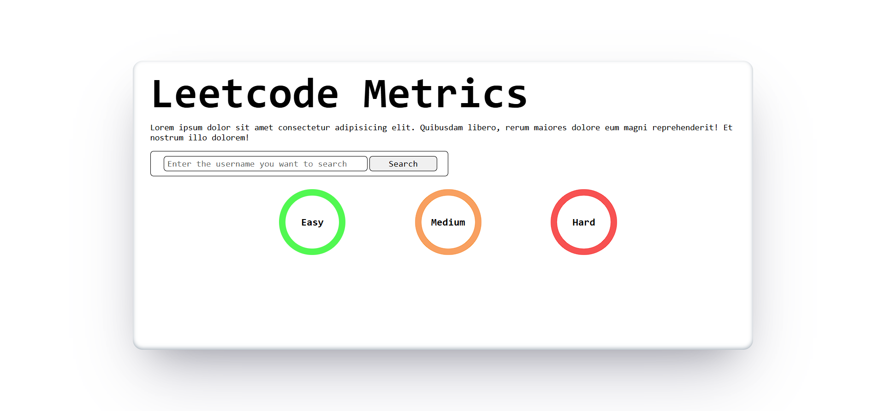
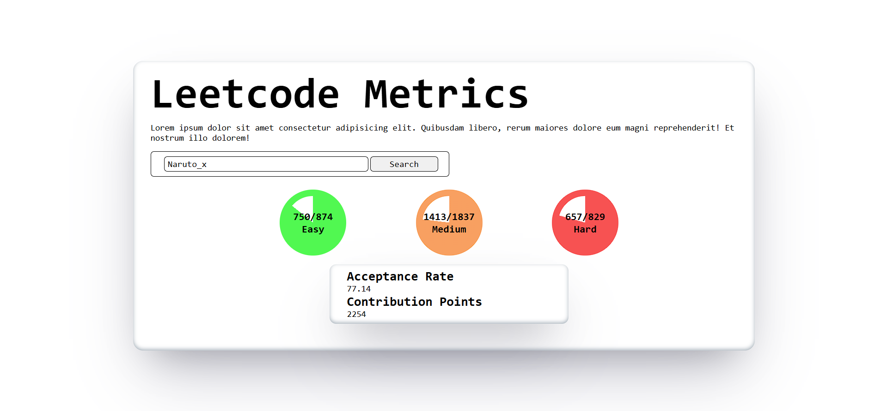
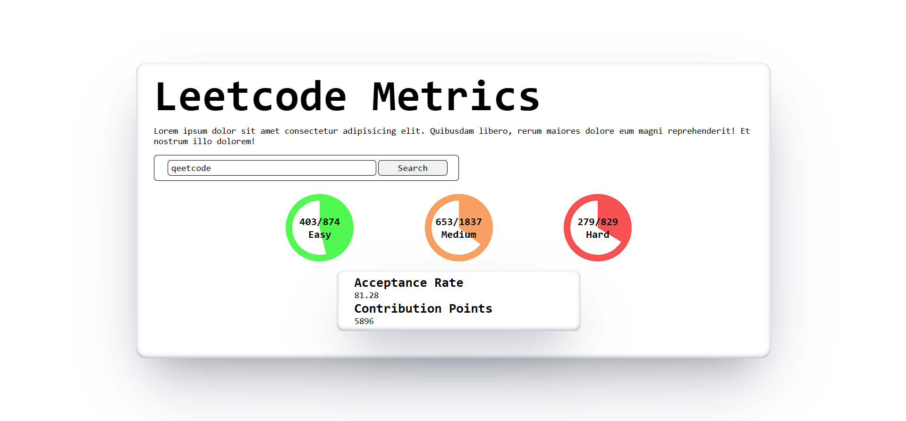

# 📊 LeetCode Metrics Dashboard

A sleek and interactive web application that fetches and displays a user's LeetCode statistics in real time. Built with HTML, CSS, and vanilla JavaScript, it visually represents problem-solving progress across Easy, Medium and Hard difficulties using colorful circular stats and data cards.

---

## 🚀 Live Demo

You can view the live project here:  
👉 

---

## 🛠️ Features

- 🔍 Search by LeetCode username
- 📈 Visual breakdown of solved vs. total problems per difficulty
- 📋 Displays additional metrics like:
  - Acceptance Rate
  - Contribution Points
- 🎨 Clean and responsive design

---

## 🧩 Built With

- **HTML5** – for page structure  
- **CSS3** – for modern styling and visual progress indicators  
- **JavaScript (ES6+)** – for logic, API interaction, and DOM manipulation  
- **[LeetCode Stats API](https://leetcode-stats-api.herokuapp.com/)** – for fetching real-time user data

## Screenshots

